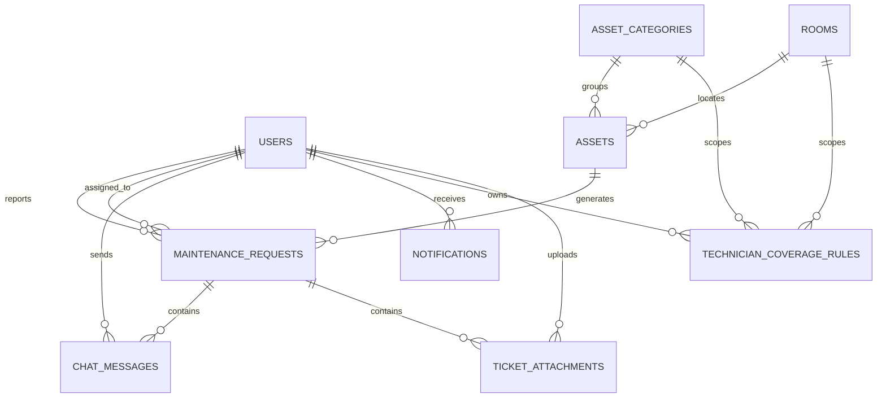
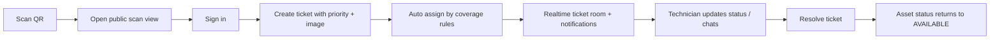

# Vong 3 Defense Pack

## Architecture
- Frontend: `frontend/` React + Vite + TypeScript SPA
- Backend: Spring Boot MVC + REST + WebSocket/STOMP
- Auth: Spring Security session cookie + CSRF
- Realtime: `/ws`, `/topic/tickets/{id}`, `/user/queue/notifications`
- Storage: SQL Server for relational data, local filesystem for ticket image attachments

## ERD

## Business Flow

## Data Flow
1. React calls `/api/*` with session cookies and CSRF token.
2. Spring services keep all asset, usage, and ticket workflow rules server-side.
3. Ticket/chat changes are persisted, then pushed to WebSocket subscribers and notification recipients.
4. React invalidates query caches after mutations and refreshes ticket/detail/dashboard views.

## AI Evidence Notes
- AI-assisted areas in this upgrade:
  schema expansion for ticket/chat/coverage tables
  REST API scaffolding and DTO shaping
  WebSocket event contract layout
  React route/app-shell bootstrapping
- Recommended demo talking points:
  show one generated draft
  show one corrected backend service or React page
  explain where AI over-generated and what was simplified to fit the existing codebase
